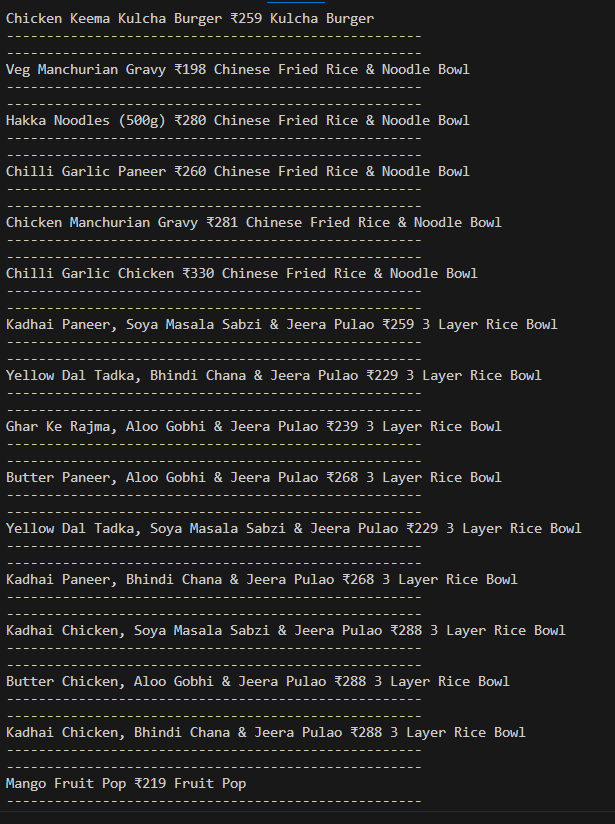
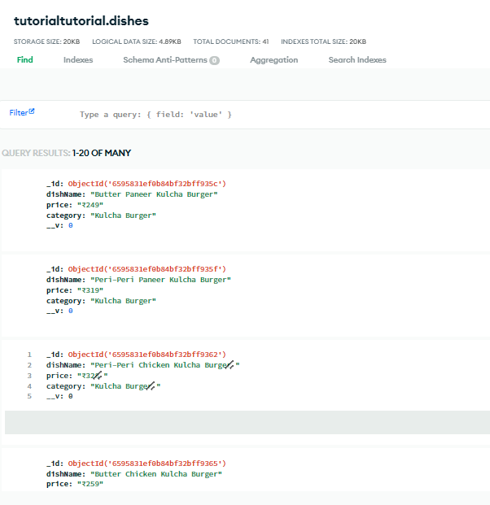

# Project Title

### MenuMaster

## Tech Stack

| PART           | TECHNOLOGIES                                                               |
| :------------- | :------------------------------------------------------------------------- |
| `Server`       | **Node.js, Exprees.js, DotEnv, Mongoose** |
| `Web Scrapper` | **Puppeteer.js**                                                           |
| `Database`     | **Mongodb-Atlas**                                                          |
| `Proxy`     | **Luminati**                                                          |

### ASSIGNMENT 1:
- EXTRACTED DATA FROM MAGICPIN
- STORED DATA TO MONGODB-ATLAS
- AS PER DISHNAME

<!-- 

 -->

